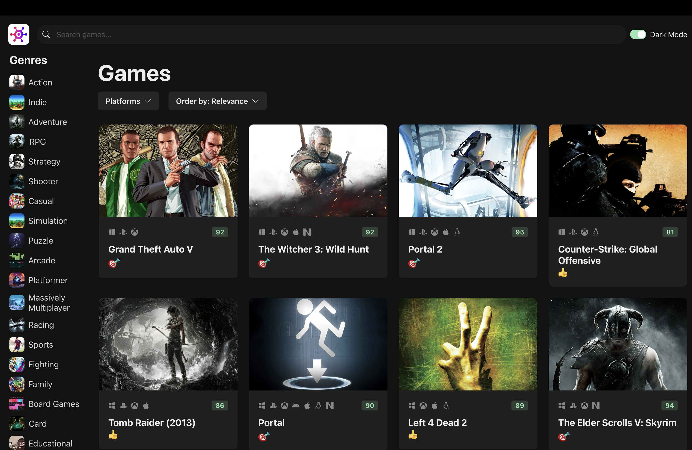
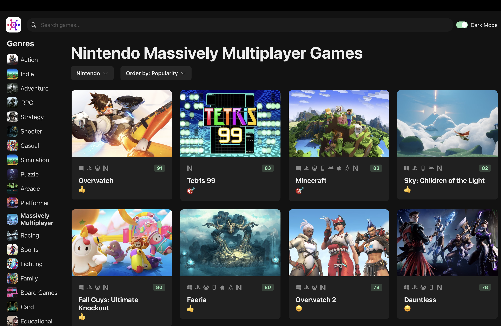

# Game Hub


A **video game discovery application** built with **React, TypeScript, and Vite** that allows users to browse and explore video games using the **RAWG Video Games Database API**.

The application provides game discovery features such as searching games, filtering by genre and platform, sorting results, and viewing critic scores. The interface is fully responsive and includes a **dark/light theme toggle**.

---

## Live Demo

Deployed on **Vercel**

[View Live Demo](https://game-hub-orcin-eight.vercel.app/)

---

## Tech Stack

- **React**
- **TypeScript**
- **Vite**
- **Chakra UI**
- **Axios**
- **RAWG Video Games Database API**

---

## Features

- Browse games from the **RAWG API**
- Search games by title
- Filter games by **genre**
- Filter games by **platform**
- Sort games by release date, popularity, rating, and more
- Display **critic scores**
- Platform icons for supported platforms
- Responsive game grid layout
- **Dark / Light theme toggle**
- Dynamic UI built with reusable React components

---

## Project Structure

```
game-hub/
│
├── public/
│
├── screenshots/
│   ├── main.png
│   ├── demo-01.png
│   └── demo-02.png
│
├── src/
│   ├── assets/
│   ├── components/
│   ├── data/
│   ├── hooks/
│   ├── services/
│   ├── App.tsx
│   └── main.tsx
│
├── index.html
├── vite.config.ts
└── tsconfig.json
```

---

## Environment Variables

Create a `.env` file in the project root and add your RAWG API key:

```
VITE_RAWG_API_KEY=your_api_key_here
```

You can obtain an API key from:

https://rawg.io/apidocs

⚠️ **Important:**  
The API key must be set before running the project locally.  
If the key is missing or invalid, the application will not be able to fetch data from the RAWG API and a network error will occur.

---

## Running the Project Locally

### 1. Clone the Repository

```bash
git clone https://github.com/mabhishek-dev/game-hub.git
cd game-hub
```

### 2. Install Dependencies

```bash
npm install
```

### 3. Start the Development Server

```bash
npm run dev
```

After the server starts, open the **local development URL shown in the terminal** (typically `http://localhost:5173`) in your browser.

---

## Screenshots

### Main Interface


### Platform Filtering and Sorting


### Genre, Platform Filtering and Sorting


---

## Disclaimer

This project uses the **RAWG Video Games Database API** for game data.

All game data, images, and related content belong to their respective owners and are provided by the RAWG API.  
This project is created for educational and demonstration purposes and is not affiliated with or endorsed by RAWG.

---

## License

This project is licensed under the **MIT License**.
